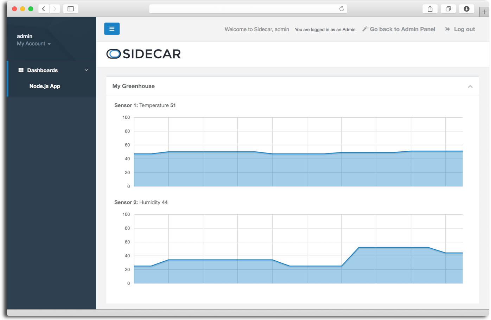

Sidecar IoT Dashboard
=========

Sidecar IoT Dashboard is a Node.js application to display data from your Raspberry Pi or compatible hardware. You can customize your Dashboard, changing sensors, chart types and uploading your own logo. The Dashboard allows users to register devices and display your data in graphs.

[](./preview.png)

## Three Key Steps to a Working Configuration.

* Launch the IoT Dashboard
* Load Drivers to your Hardware
* Push Data

Sidecar IoT Dashboard is portable so you can quickly test and personalize it locally or on any cloud computing service such as AWS, Google Cloud, Microsoft Azure, or Heroku.

## Important Concepts

The **Sidecar Console** is used by the **Developer** (you) for creating and managing new **Applications** created on the **Sidecar API Platform**.

The **Sidecar IoT Dashboard** is a portable self hosted NodeJS application that is used by the **Developer** to create and deploy a End User facing **Application**.

It can be deployed locally or on a Cloud instance or server, all the source files are provided so you can customize or extend it to your needs.

There are two aspects to the **Sidecar IoT Dashboard**, first the admin panel which the Developer uses to configure the Dashboard for use by the End Users. The second aspect is the **End User Login Page**.

**End Users** can create an account and add **Hardware** to their Accounts, the Hardware will connect to the **Sidecar API** to push or get data.

## 1. Launch the IoT Dashboard

**Choose where you will deploy the Dashboard.** The Developer/End User Dashboard is based on NodeJS and talks to the Sidecar backend. It's portable and can be deployed locally, Google Cloud or Amazon Web Services or another Raspberry Pi.

**Decide Raspberry Pi + PC/Mac Configuration.** The device driver runs on the Raspberry and the hosted dashboard runs on your PC/Mac or cloud. If running locally: the Raspberry and PC/Mac must be on the same network range. If you are hosting the dashboard the Raspberry must be able to connect to the dashboard via the internet. An ideal first test situation is a Raspberry with keyboard & monitor on the same network as a PC/Mac.

**Fork the Repo (optional).** Make your own copy of this repo to your own github account

**Download Dashboard Repository.** Go to the Sidecar IoT Dashboard repository on Github , download it or use Github to clone it to your server in your preferred directory

**Install NodeJS.** Make sure you have installed Node.js in your machine. From your Terminal, please run this command:

```
node --version
```

This will check if you have Node.js installed and if so will confirm your version. Otherwise, please install Node.js.

**Install dependencies for your Sidecar IoT Dashboard.** Change to your directory where you downloaded the Sidecar Device Firmware.

```
cd sidecar-iot-dashboard
sudo npm install
```

**Copy and rename Config File.** Copy and rename the file configure.original.js to configure.js by running the following command:

```
sudo cp configure.original.js configure.js
```

**Check for conflicts.** The Sidecar IoT Dashboard runs by default in port 80. If testing on your local machine, you may need to stop Apache server by running:

```
sudo apachectl stop
```

**Start your Dashboard App.** Check your dashboard is running at http://localhost (if launching on Amazon or Google Cloud insert your IP address + ensure your instance security policies allow access)

```
sudo node app.js
```

**Create Developer Application Keys.** Create a new Application from the [Sidecar Console](https://console.sidecar.io/) website

Copy the Access Keys (KeyId and Secret).

**Login to Developer Dashboard.** Login http://localhost/admin

User Name: admin
Password: root

NOTE: Credentials should be changed immediately by modifying the file /sidecar-iot-dashboard/db/adminUsers.js

**Add Sidecar Application Keys + Secrets.** Paste the Access Keys (KeyId and Secret) from the Console and insert your name, email and password and save. This will create your first user. Check that the App created a User ID & Secret.

**Customise the Dashboard**, charts and sensors as required (optional, the defaults will produce a working demo)

**Register a New Device and Generate Firmware**

This code is auto generated and contains the credentials + API commands required to join your node.js compatible hardware to your specific application.

Press the Register Device Button

Press the Generate Device Firmware Button

Press the Download Device Firmware Button

Copy the downloaded directory into your preferred application directory

## 2. Load Drivers to your Hardware

**Download NodeJS Device Firmware.** Download it from your Admin Panel (see previous step) to your Node.js compatible hardware into your preferred directory.

**Setup NodeJS on your Hardware.** Make sure you have installed Node.js in your machine. From your Terminal, please run this command:

```
node --version
```

This will check if you have Node.js installed and if so will confirm your version. Otherwise, please install Node.js.

**Install Device Firmware onto the hardware.** Install the required dependencies inside your preferred directory

```
sudo npm install
```

## 3. Push Data

**Change Sensor Value (optional, default settings provide a working demo).** In the demo firmware/app model, two random variables are sent to the Sidecar Cloud. You can send your own data sensors by modifying the following lines of code in the app.js file and adding your own data from your sensors:

```
//Replace this with your own sensor data 1
sensorData1 = Math.floor((Math.random() * 39) + 25)

//Replace this with your own sensor data 2
sensorData2 = Math.floor((Math.random() * 32) + 23)
```

**Start App On Hardware.**

```
sudo node app.js
```

Your Device should be sending data to the Sidecar Cloud.

**Check your End User Dashboard.** Your Device should now be pushing data to the cloud and displaying it on your dashboard.


## Contact [Sidecar.io](http://sidecar.io)

We love hearing from you!

**For support or technical questions** please email support [at] sidecar.io
Likewise, feel free to check out our other resources: [Sidecar Docs](http://docs.sidecar.io) and [API Docs](http://api.sidecar.io/docs/).
